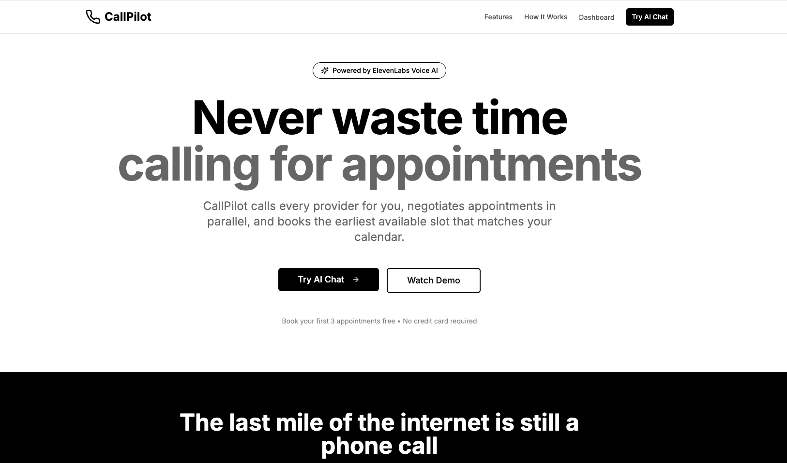

# CallPilot - Autonomous Voice AI Appointment Scheduling



CallPilot is an AI-powered appointment booking service that autonomously calls service providers, negotiates appointment slots, and finds you the earliest available appointment that matches your preferences.

## Architecture

### Consumer App Approach
CallPilot follows a consumer-app architecture where:
- **Users interact with a simple web/mobile interface**
- **AI agents work behind the scenes** to handle the complexity
- Users see only the results, not the agent orchestration

```
User App (Web / Mobile)
        |
        v
CallPilot Orchestrator (Backend)
        |
        +-- Preference Engine
        +-- Calendar Engine
        +-- Ranking Engine
        |
        +-- Swarm Controller
              |
              +-- ElevenLabs Voice Agent #1
              +-- ElevenLabs Voice Agent #2
              +-- ElevenLabs Voice Agent #3
```

## Tech Stack

### Frontend
- **Next.js 15** - React framework
- **TypeScript** - Type safety
- **TailwindCSS** - Styling (Black & White theme)
- **Radix UI** - Component primitives
- **Lucide React** - Icons

### Backend
- **Flask** - Python web framework
- **ElevenLabs Conversational AI** - Voice agents
- **Twilio** - Phone infrastructure
- **Google APIs**:
  - Calendar API (availability checking)
  - Places API (provider search)
  - Maps API (distance calculation)

## Features

### Core Features
1. **Voice AI Agents** - Natural conversation with receptionists
2. **Parallel Calling** - Call up to 15 providers simultaneously
3. **Smart Ranking** - Score options by availability, rating, distance
4. **Calendar Integration** - Real-time availability checking
5. **Autonomous Booking** - Complete end-to-end automation

### Key Differentiators
- **User never talks to agents** - Magic, not complexity
- **Focus on outcomes** - "Booked at SmileCare, Tuesday 10:30"
- **Consumer product** - Not an agent marketplace

## Getting Started

### Prerequisites
- Node.js 18+ and npm
- Python 3.11+
- ElevenLabs API key
- Google Cloud project with APIs enabled
- Twilio account

### Frontend Setup

```bash
cd frontend
npm install
npm run dev
```

The frontend will be available at http://localhost:3000

### Backend Setup

```bash
cd backend
python -m venv venv
source venv/bin/activate  # On Windows: venv\Scripts\activate
pip install -r requirements.txt

# Copy and configure environment variables
cp .env.example .env
# Edit .env with your API keys

python app.py
```

The backend will be available at http://localhost:8080

## Environment Variables

### Backend (.env)
```
ELEVENLABS_API_KEY=your-key
GOOGLE_CALENDAR_API_KEY=your-key
GOOGLE_PLACES_API_KEY=your-key
GOOGLE_MAPS_API_KEY=your-key
TWILIO_ACCOUNT_SID=your-sid
TWILIO_AUTH_TOKEN=your-token
TWILIO_PHONE_NUMBER=your-number
```

## Project Structure

```
callpilot/
├── frontend/
│   ├── app/
│   │   ├── page.tsx          # Landing page
│   │   ├── layout.tsx        # Root layout
│   │   └── globals.css       # Global styles (B&W theme)
│   ├── components/
│   │   └── ui/               # Reusable UI components
│   └── lib/
│       └── utils.ts          # Utility functions
│
├── backend/
│   ├── app.py                # Flask application
│   ├── services/
│   │   ├── elevenlabs_service.py   # Voice AI integration
│   │   ├── google_service.py       # Google APIs
│   │   └── ranking_engine.py       # Option ranking
│   ├── models/               # Data models
│   └── api/                  # API endpoints
│
└── README.md
```

## How It Works

1. **User Request**: User types or speaks their appointment need
2. **Provider Search**: System finds relevant providers via Google Places
3. **Parallel Calling**: ElevenLabs agents call multiple providers simultaneously
4. **Results Aggregation**: Calls are processed and scored
5. **Smart Ranking**: Options ranked by availability, rating, and distance
6. **User Confirmation**: User sees top options and confirms choice
7. **Booking**: System completes booking and adds to calendar

## API Endpoints

### POST `/api/booking/request`
Create a new booking request
```json
{
  "service_type": "dentist",
  "timeframe": "this week",
  "location": "San Francisco, CA",
  "preferences": {
    "rating_weight": 0.3,
    "distance_weight": 0.3,
    "availability_weight": 0.4
  }
}
```

### GET `/api/booking/{booking_id}`
Get status of booking request

### POST `/api/booking/{booking_id}/confirm`
Confirm selected booking option

## Development Roadmap

### ✅ MVP (Phase 1) - Completed
- [x] **Landing page and UI** - Modern Next.js 15 interface with dashboard
- [x] **Multi-provider calling** - Parallel calls to multiple service providers
- [x] **Google Places integration** - Provider search and location services
- [x] **Smart ranking algorithm** - Score by availability, rating, and distance
- [x] **ElevenLabs voice agents** - AI-powered phone conversations
- [x] **Real-time task tracking** - Progressive updates as calls complete
- [x] **AI chat assistant** - Natural language booking interface
- [x] **Cloud deployment** - Production-ready on Google Cloud Run
- [x] **Chronological results** - Display results in call order
- [x] **Demo data seeding** - Quick setup for presentations

### Phase 2 (In Progress)
- [x] Parallel calling (swarm mode) - Up to 15 simultaneous calls
- [x] ElevenLabs conversational AI integration
- [ ] Calendar integration (Google Calendar API)
- [ ] Advanced ranking with user preferences
- [ ] User accounts and booking history
- [ ] Automated booking confirmation

### Phase 3 (Planned)
- [ ] Rescheduling/cancellation agents
- [ ] Waitlist management
- [ ] Multi-language support
- [ ] SMS/Email notifications
- [ ] Enterprise features (team accounts, reporting)
- [ ] Mobile app (React Native)

## Contributing

This is a hackathon project for the ElevenLabs challenge. Contributions welcome!

## License

MIT License - see LICENSE file for details

## Credits

Built for the ElevenLabs Agentic Voice AI Challenge
- Challenge: CallPilot - Agentic Voice AI for Autonomous Appointment Scheduling
- Technology: ElevenLabs Conversational AI, Google APIs, Next.js, Flask
